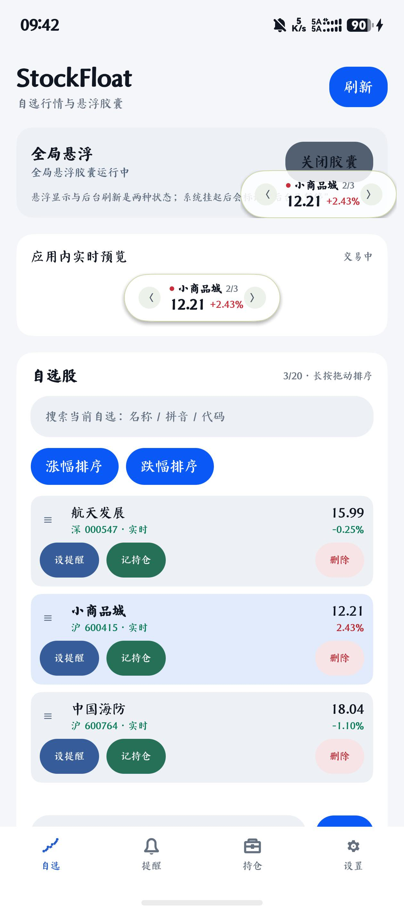
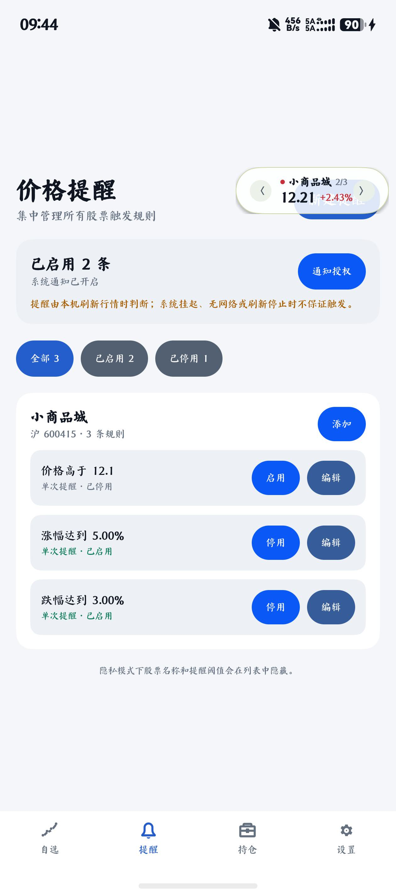
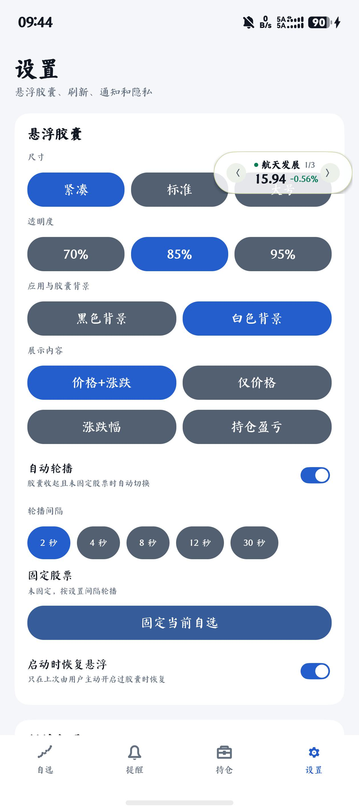

# StockFloat HarmonyOS 个人版

基于 MIT 开源项目 `StockFloatMVP` 思路实现的 HarmonyOS NEXT / ArkTS 个人 A 股悬浮行情助手。

[](https://developer.huawei.com/consumer/cn/)
[](https://github.com/houchaowei/StockFloatHarmonyMVP/releases/latest)
[](LICENSE)

## App 使用截图

以下截图来自 v0.3.1 HarmonyOS 真机运行界面，展示当前白色主题、悬浮胶囊和对齐后的底部导航。

<p align="center">
  
  
  
</p>

<p align="center">
  自选行情与应用内预览 · 价格提醒管理 · 应用与胶囊统一背景设置
</p>

## Release 下载

当前稳定版本为 **v0.3.1**。可从 [GitHub Releases](https://github.com/houchaowei/StockFloatHarmonyMVP/releases/latest) 下载签名 HAP。

Release 构建用于个人真机测试；首次安装或覆盖安装仍受设备版本、签名 Profile 与 `SYSTEM_FLOAT_WINDOW` ACL 限制。若系统拒绝全局悬浮权限，应用内行情、自选、提醒、持仓和胶囊预览仍可正常使用。

### v0.3.1 更新

- 黑色/白色背景统一控制主应用、输入框、底部导航、系统栏和悬浮胶囊。
- 底部导航改为等宽独立布局与统一 SVG 图标，修复真机对齐问题。
- 提高暗色输入框 placeholder 与正文文字对比度。
- 真机拒绝短时后台任务时正确降级，不再显示 `9900002` 原始错误。

## 已实现

- `WindowType.TYPE_FLOAT` 全局悬浮窗口，主应用退到后台后仍可显示
- 紧凑、标准、大号三档胶囊尺寸；应用与胶囊共用黑/白背景设置，透明度及展示指标可调
- 拖动、边界限制、松手自动吸附左右边缘、位置持久化
- 横竖屏、分屏及折叠形态变化后自动重新约束位置
- 单击中间行情区展开；展开后可收起、刷新、切换股票和关闭
- 长按只展开/收起，关闭操作保留在展开卡片中，避免误关
- 腾讯主行情源 + 新浪备用行情源，均使用 `ArrayBuffer + GB18030` 解码
- 股票名称、现价、涨跌额、涨跌幅及行情时间解析
- 每只股票显示实时、延迟、过期、缓存、收盘或后台暂停状态
- 通过行情日期识别法定节假日/交易日休市，避免假期高频轮询
- 默认自选：贵州茅台 `600519`、平安银行 `000001`、宁德时代 `300750`
- 代码、中文名称或拼音在线搜索并验证添加、最多 20 只；名称/拼音/代码筛选、拖拽排序、涨跌排序、删除撤销
- 轮播开关、2–30 秒轮播间隔、固定当前股票；交易中 5/10/30 秒刷新可调
- 请求失败指数退避并保留上次有效行情
- 最近一次有效行情会缓存到本地，离线重启时先展示缓存再尝试更新
- 展开卡片展示今开、最高、最低、本地采样迷你走势和交易所时区行情时间
- 到价及涨跌幅提醒，支持单次、30 分钟冷却重复、每交易日一次
- 可选常驻行情通知，作为悬浮权限不可用时的降级入口
- 本地录入成本价和数量，展示累计/今日盈亏；持仓不会上传或同步
- 隐私模式、红涨绿跌/绿涨红跌、启动恢复悬浮状态
- 全局权限不可用时仍可在主页面使用完整胶囊预览
- 自选、提醒、持仓、设置四个底部入口；提醒与持仓使用独立的新建/编辑二级页面

## 运行

建议环境：DevEco Studio 6.1.1 或更新版本，HarmonyOS NEXT API 12+，真机优先。本项目以 API 24 编译、最低兼容 API 12。

1. 用 DevEco Studio 打开本目录。
2. 等待 Sync 完成，在 **File → Project Structure → Signing Configs** 配置自动签名或调试签名。当前开发机已配置，无需重复操作。
3. 按下面“全局悬浮权限”配置调试 ACL。
4. 连接 HarmonyOS NEXT 手机，运行 `entry`。
5. 首屏行情出现后点击“开启胶囊”，再把应用退到后台验证全局显示。

项目不会把某台电脑特有的证书、口令或 SDK 路径提交到 Git。`hvigorfile.ts` 会在本机存在 `.signing/local-signing.json` 时将它作为内存签名覆盖使用；该文件已被 `.gitignore` 排除。换电脑或删除此文件后，需要在 DevEco 重新配置签名。

## 全局悬浮权限

全局胶囊依赖：

```json5
{ "name": "ohos.permission.SYSTEM_FLOAT_WINDOW" }
```

该权限是 `system_basic` 受限权限，普通应用仅在 `module.json5` 声明还不够。开发调试时需要把它加入调试 Profile 的 ACL。官方提供两种调试方式，均不能直接用于应用市场发布；正式发布需要申请相应发布证书/权限资质。

DevEco / SDK 版本的具体界面可能不同。通用流程是：

1. 找到当前 HarmonyOS SDK 使用的调试 `HarmonyAppProvision` 模板或 Profile。
2. 在 `acls.allowed-acls` 中加入 `ohos.permission.SYSTEM_FLOAT_WINDOW`。
3. 重新签名并安装应用。

示意：

```json5
{
  "acls": {
    "allowed-acls": [
      "ohos.permission.SYSTEM_FLOAT_WINDOW"
    ]
  }
}
```

如果没有 ACL，应用不会崩溃：首页会显示“缺少 SYSTEM_FLOAT_WINDOW ACL”，此时可以先用“应用内实时预览”验收行情和交互。

## 功能验收

1. 启动后 10 秒内能看到三只默认自选的名称和价格。
2. 输入 `600036`、`招商银行` 或 `zhaoshangyinhang` 并添加，在线搜索和行情验证后出现“招商银行”。
3. 搜索“茅台”“maotai”“mt”或 `600519` 均可过滤当前自选。
4. 长按拖动自选调整顺序；删除后 6 秒内可撤销；涨幅/跌幅排序可用。
5. 收起胶囊按设置轮播；固定当前股票或展开后停止轮播。
6. 开启全局胶囊后退到桌面或其他应用，胶囊仍显示；后台延迟到期后标记“后台已暂停”。
7. 拖动胶囊后自动吸边；旋转屏幕后仍在可视范围；重启后恢复位置和用户启用状态。
8. 展开卡片可看到今开、最高、最低、走势、新鲜度、数据源和行情时间。
9. 切换底部“提醒”，新建高于/低于价格及涨/跌幅提醒，验证单次、重复、每日三种模式；通知未授权时规则仍保存，自选列表“设提醒”可直接带入股票。
10. 切换底部“持仓”，新增或编辑成本价与数量；汇总页和展开胶囊显示持仓盈亏，隐私模式下名称、代码、价格、阈值和盈亏均被遮挡。
11. 断网后刷新保留最后价格并标记缓存/过期；恢复网络后主源或备用源可更新。
12. 切换底部“设置”，调整尺寸、黑/白背景、透明度、展示指标、涨跌颜色、轮播和刷新间隔，悬浮窗立即或下次刷新生效；从提醒/持仓编辑页使用系统返回可回到对应列表。

## 自动验证

无需 DevEco 的结构与解析测试：

```bash
node tools/verify.mjs
```

连真实腾讯接口一起验证：

```bash
node tools/verify.mjs --live
```

设备构建可在 DevEco Terminal 中执行：

```bash
hvigorw assembleHap
```

如果终端找不到 `hvigorw`，直接使用 DevEco 的 **Build → Build Hap(s)/APP(s) → Build Hap(s)**。本仓库保留的是可由 IDE 同步的 Hvigor 项目文件，不绑定本地 wrapper 缓存。

本机签名配置有效时，可安装的 HAP 位于 `entry/build/default/outputs/default/entry-default-signed.hap`；`entry-default-unsigned.hap` 仅是构建中间产物，不能安装到真机。若只生成未签名包或看到 `no signature file`，请确认 `.signing/local-signing.json` 存在且证书未过期，或回到 DevEco 的 **Signing Configs** 重新生成调试签名。

## 代码结构

```text
entry/src/main/ets/
├── components/MiniSparkline.ets      本地行情采样迷你走势
├── components/QuoteCapsule.ets       胶囊和展开卡片 UI
├── entryability/EntryAbility.ets     应用入口和生命周期
├── model/FloatWindowManager.ets      TYPE_FLOAT、拖动、吸边、持久化
├── model/ApplicationTheme.ets        应用与胶囊统一黑白主题
├── model/QuoteStore.ets              自选、缓存、刷新、轮播、交易日识别
├── model/PersonalModels.ets          提醒、持仓、走势和胶囊配置模型
├── model/PersonalStore.ets           个性化持久化、提醒与通知
├── model/StockModels.ets             股票模型、交易阶段和行情新鲜度
├── model/CompositeQuoteProvider.ets  主备行情编排
├── model/TencentQuoteProvider.ets    腾讯主行情源
├── model/TencentStockSearchProvider.ets 腾讯股票名称/拼音联想搜索
├── model/SinaQuoteProvider.ets       新浪备用行情源
├── pages/FloatCapsule.ets            全局悬浮窗口页面
├── pages/WatchlistPage.ets           自选、胶囊控制和应用内预览
├── pages/AlertsPage.ets              提醒汇总与筛选
├── pages/AlertEditorPage.ets         提醒新建/编辑二级页面
├── pages/PositionsPage.ets           本地持仓汇总
├── pages/PositionEditorPage.ets      持仓新建/编辑二级页面
├── pages/SettingsPage.ets            胶囊、行情、通知和隐私设置
└── pages/Index.ets                   底部导航与二级页面容器
```

## 数据与发布限制

腾讯和新浪公开行情接口只用于个人原型验证。它们没有向本项目提供商业展示或再分发授权，可能限流、变更或停止服务。公开发布、售卖或上架前必须替换为取得书面授权的行情供应商，并复核交易日历、后台策略、通知、隐私说明和应用市场悬浮窗审核要求。

系统延迟挂起只能延长一段后台执行时间，不能保证全天轮询。价格提醒只在应用实际刷新到行情时判断；系统挂起、强制停止、关机或断网期间不承诺触发。需要强保证提醒时应接入取得授权的服务端行情和推送。

本应用不包含登录、交易或券商连接，界面信息不构成投资建议。详情见 `THIRD_PARTY_NOTICES.md`。

## 与原版的关系

本项目参考 MIT 开源版 `StockFloatMVP` 的实现思路，保留了其数据源隔离、交易阶段刷新、失败保留旧值、轮播和自选持久化设计，并把 macOS 圆形窗口重新实现为 HarmonyOS 手机胶囊式全局窗口。
